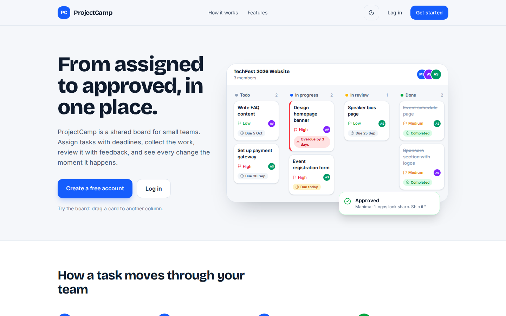

<div align="center">

# 🗂️ ProjectCamp

### From assigned to approved, in one place.

A real-time project management app for small teams — college groups, fest committees, startups and freelancers.

[](https://projectcamp-app.vercel.app)


<br />



</div>

---

## 📖 About

Small teams usually juggle work across WhatsApp groups, Drive links and spreadsheets. Tasks get lost, deadlines slip, and nobody is sure whether the work was actually checked.

**ProjectCamp puts the whole workflow on one shared board.** An admin creates a project, invites the team and assigns tasks with a priority and a deadline. Members do the work and submit it with files and links. The admin reviews it — approves it, or asks for changes with clear feedback. Every update shows up live on everyone's screen, the team chats in the same place, and reminders go out before a deadline is missed.

```
📁 Create project  →  📝 Assign task  →  📤 Member submits  →  🔍 Admin reviews  →  ✅ Done
```

---

## ✨ Features

<table>
<tr>
<td width="50%" valign="top">

### 📋 Plan the work
- **Kanban board** with drag & drop, plus a list view
- Priority, due date, file attachments and links on every task
- **Smart sorting** — overdue first, then priority, then nearest deadline
- Search and filters by status, priority and member
- **My Tasks** — everything assigned to you, across every project

</td>
<td width="50%" valign="top">

### ✅ Submit & review
- Members submit **files, links and a note**
- Admins **approve** or **request changes** — feedback is required, so members always know what to fix
- Full history of every attempt with reviewer comments
- Visual workflow: Todo → In Progress → In Review → Completed

</td>
</tr>
<tr>
<td width="50%" valign="top">

### ⚡ Work together, live
- Board moves, comments and reviews **sync instantly** for everyone
- **Project chat** with typing indicators and unread badges
- Task discussions, shared notes and a live **activity feed**
- In-app notifications

</td>
<td width="50%" valign="top">

### ⏰ Never miss a deadline
- **Daily reminder email** for tasks due today, tomorrow or overdue
- One digest per person — never duplicated
- Admins are alerted when assigned work runs late
- Emails can be turned off from the profile

</td>
</tr>
<tr>
<td width="50%" valign="top">

### 📊 Know where you stand
- Completion rate, **on-time rate** and average time to finish
- Charts for progress trend, status and priority
- Workload and performance for each member
- Download a project report as **PDF** or **CSV**

</td>
<td width="50%" valign="top">

### 🔐 Secure & polished
- Email verification and **Google Sign-In**
- Role-based access — Admin and Member
- Files stored on **Cloudinary**
- Dark mode and a fully responsive mobile layout

</td>
</tr>
</table>

---

## 👥 Who can do what

| Action | Admin | Assigned member | Other members |
|---|:---:|:---:|:---:|
| Manage project & team | ✅ | — | — |
| Create, edit, delete tasks | ✅ | — | — |
| Move task on the board | Any column | Todo ↔ In Progress | — |
| Submit work | — | ✅ | — |
| Review & give feedback | ✅ | — | — |
| Chat, comment, notes, analytics, reports | ✅ | ✅ | ✅ |

---

## 🛠️ Tech Stack

| Layer | Technologies |
|---|---|
| **Frontend** | React 19, Vite, Tailwind CSS 4, React Router, Zustand, Axios, Chart.js |
| **Backend** | Node.js, Express 5, MongoDB, Mongoose |
| **Real-time** | Socket.io (authenticated rooms per user and per project) |
| **Auth** | JWT access + refresh tokens in httpOnly cookies, Google OAuth |
| **Services** | Cloudinary · Nodemailer + Gmail · node-cron · PDFKit |
| **Hosting** | Vercel (frontend) · Render (backend) · MongoDB Atlas |

---

## 🧠 Engineering Highlights

- **Real-time sync** — Socket.io rooms per project; socket connections are authenticated with JWT
- **Deploy-safe auth** — API proxied through Vercel so login cookies stay first-party (works on Safari/iPhone too)
- **Reminder engine** — node-cron job that runs in India time and never sends the same reminder twice
- **Security** — cross-project access checks (IDOR), upload type filtering, regex escaping, CSV-injection protection and strong password rules
- **Performance** — route-level code splitting (main bundle ~700 KB → ~260 KB), MongoDB indexes, cursor-based pagination for chat and activity

📘 **Full story of how every feature was built, every bug fixed and every decision made:**
[docs/PROJECTCAMP_DEVELOPMENT_GUIDE.md](docs/PROJECTCAMP_DEVELOPMENT_GUIDE.md)

---

<details>
<summary><b>💻 Run it locally</b></summary>

<br />

```bash
git clone https://github.com/Aditya-321-prog/project-management.git
cd project-management

# Backend
cd backend
npm install
cp .env.example .env    # add MongoDB URI and JWT secrets
npm run dev             # http://localhost:8000

# Frontend (new terminal)
cd frontend
npm install
npm run dev             # http://localhost:5173
```

Minimum `backend/.env`:

```env
PORT=8000
CORS_ORIGIN=http://localhost:5173
FRONTEND_URL=http://localhost:5173
MONGO_URI=your_mongodb_uri
ACCESS_TOKEN_SECRET=long_random_string
REFRESH_TOKEN_SECRET=another_long_random_string
ACCESS_TOKEN_EXPIRY=1d
REFRESH_TOKEN_EXPIRY=10d
```

Email (Gmail), Cloudinary and Google login are optional — see `backend/.env.example`.

</details>

---

<div align="center">

Built with ❤️ by **[Aditya-321-prog](https://github.com/Aditya-321-prog)**

⭐ If you found this project useful, consider giving it a star!

</div>
